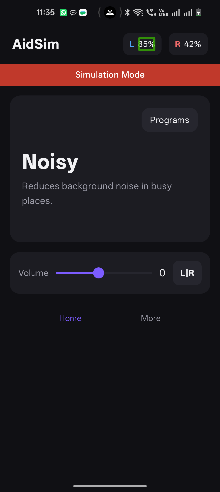
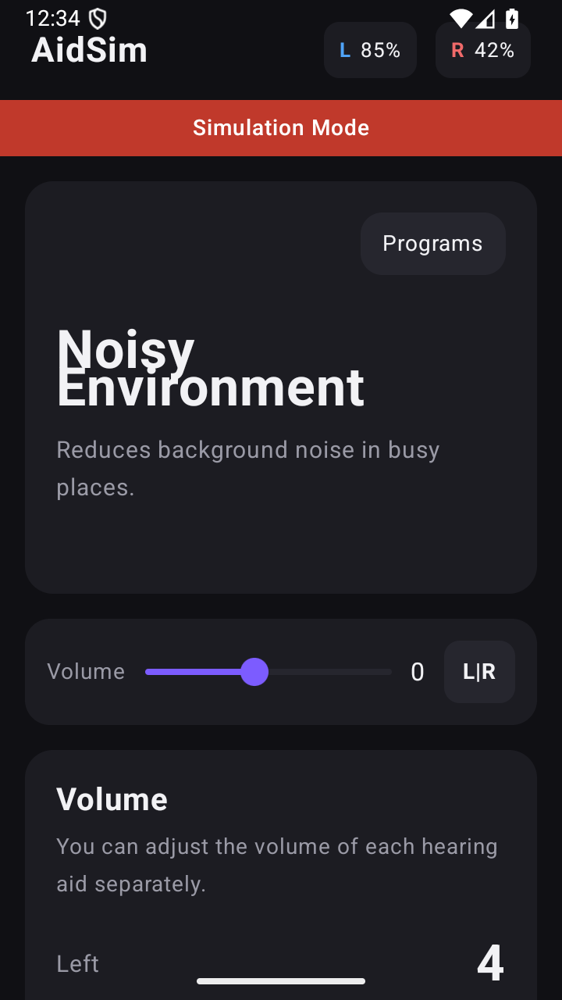
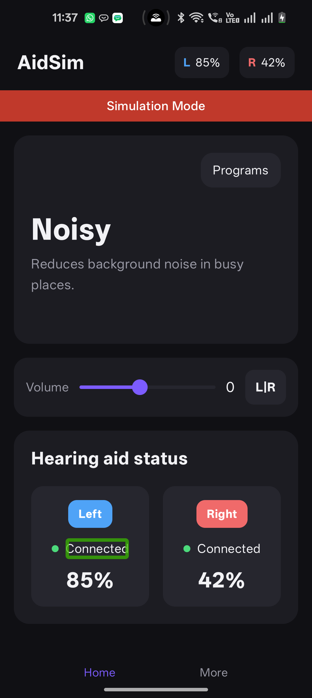

# TalkBack Audio Validation — Evaluator Guide

Reference: this directory (`talkback-audio-validation/`). This document explains how an
evaluator runs the pipeline, what "evaluated" means in terms of verdicts and
reason codes, and walks through real, already-executed test cases — showing
what TalkBack said, what the screen showed, and why the comparator ruled the
way it did.

---

## 1. What is being evaluated

The tool checks a single claim: **does Android's TalkBack screen reader say
out loud the same value the screen is showing?** A UI test that reads the
accessibility tree cannot catch a bug where the tree is correct but the
*spoken label* is wrong — e.g. the screen shows `-3` but TalkBack announces
"level 3". This tool catches that class of bug by actually recording the
phone's speaker and comparing the transcript against an independently read
screen value.

```
screen -> TalkBack -> speaker -> air -> microphone -> WAV -> speech model -> spoken value
screen -> screenshot OCR + accessibility text node ------------------------> shown value
                    Python comparator -> PASS / FAIL / INCONCLUSIVE / ERROR
```

Two rules keep the result honest:

- **The speech model only ever receives audio.** Never the screenshot, the
  expected value, or the intent extras that set up the test scenario — so it
  cannot infer the right answer, only report what it heard.
- **Only the comparator (plain Python, not a model) ever sees both channels**
  and decides equality.

---

## 2. How an evaluator runs the setup

### 2.1 Zero-hardware smoke run (start here)

No phone, no microphone, no API key required. Runs from a clean clone against
six committed audio fixtures:

```bash
./run-demo.sh --replay
```

This does, in order:
1. Installs `uv` if missing, then `uv sync --quiet` (base dependencies only).
2. Runs the full pytest suite (`uv run --with pytest pytest -q`).
3. Executes `talkback-validator replay fixtures --out runs/replay`.
4. Opens the generated `runs/replay/index.html` dashboard in the browser.

### 2.2 Full live run against a real device

```bash
./run-demo.sh
```

This additionally installs `uv sync --extra cloud --extra capture --extra ocr --extra local`,
requires a connected Android phone over `adb` with TalkBack enabled, a working
microphone, and (for the default cloud backend) `GEMINI_API_KEY` set in
`talkback-validator/.env`. It side-loads the shipped `artifacts/aidsim.apk`
directly — **no Gradle build, no Android SDK, no app source is ever touched**
by the validator. That boundary is enforced by
`tests/test_black_box_boundary.py`, which fails the build if any validator
source imports or references the app's own source tree.

### 2.3 Prerequisite check

```bash
cd talkback-validator && uv run talkback-validator doctor
```

Prints an `[ok]/[FAIL]` line per prerequisite — device connectivity, TalkBack
enabled state, microphone availability, OCR engine, cloud model reachability,
local model reachability, and output-directory writability — and exits
non-zero if anything is missing.

### 2.4 Driving a specific scenario

```bash
uv run talkback-validator run aidsim --defect volume_sign --control
```

`--defect` sets the phone into a specific broken state (see §5); `--control`
adds one extra capture with TalkBack switched off, which should record
silence — the negative control described in §4.

### 2.5 Test suite

```bash
cd talkback-validator && uv run --with pytest pytest -q
```

138 tests, confirmed passing as of this write-up. Beyond ordinary coverage,
several are regression tests written for specific failures encountered during
development (torn JSON while a live log was being written concurrently, a
dead-server state leaving the UI's Run button disabled forever, a model
reporting itself unavailable while calls to it were actually succeeding,
etc.) — each locks down one real incident, not a checklist item.

---

## 3. The decision pipeline (how a verdict is reached)

`compare()` in `comparison.py` is the single function that ever sees both the
spoken value and the visual value. It resolves in a fixed gate order, so a
capture with a problem never gets to a PASS/FAIL comparison at all:

| Order | Gate | Outcome if it trips |
|---|---|---|
| 1 | Infrastructure error (adb dropped, mic unavailable) | `ERROR` |
| 2 | Negative control captured actual speech | `ERROR` — the whole run is untrusted |
| 3 | Accessibility settings changed mid-capture | `INCONCLUSIVE` (`ACCESSIBILITY_SUPPRESSED`) |
| 4 | Accessibility focus on the target never confirmed | `INCONCLUSIVE` (`FOCUS_NOT_CONFIRMED`) |
| 5 | Displayed value changed during the capture window | `INCONCLUSIVE` (`STATE_CHANGED`) |
| 6 | Audio truncated | `INCONCLUSIVE` (`AUDIO_TRUNCATED`) |
| 7 | OCR and the accessibility text node disagree with each other | `INCONCLUSIVE` (`VISUAL_CHANNELS_DISAGREE`) |
| 8 | Neither visual channel produced a readable value | `INCONCLUSIVE` (`VISUAL_VALUE_UNREADABLE`) |
| 9 | Transcript parsed to two conflicting values | `INCONCLUSIVE` (`SPOKEN_VALUE_AMBIGUOUS`) |
| 10 | Transcript parsed to a value outside the field's valid range | `INCONCLUSIVE` (`SPOKEN_VALUE_OUT_OF_RANGE`) |
| 11 | No value could be parsed out of the transcript at all | `INCONCLUSIVE` (`SPOKEN_VALUE_ABSENT` / `AUDIO_SILENT`) |
| 12 | Spoken value equals visual value | **`PASS`** (`MATCH`) |
| 13 | Spoken value differs from visual value | **`FAIL`** (`MISMATCH`, or a field-aware reason — see below) |

Two of the `FAIL` reasons are field-aware, not generic string mismatches:

- **`VOLUME_SIGN_LOST`** — for a `signed_level` field, when the spoken number
  equals the *absolute value* of a negative displayed number (`-3` shown,
  `3` heard). This is exactly the sign-drop bug the tool exists to catch.
- **`PROGRAM_NAME_MISMATCH`** — for a `name_with_state` field.

`INCONCLUSIVE` is a first-class result, never silently folded into a pass or
a fail — abstaining when the evidence doesn't support a decision is treated
as more honest than guessing.

---

## 4. The negative control

Every run can add one extra capture with TalkBack switched off. It should
record silence. Without it, a silent capture is ambiguous — did TalkBack fail
to speak, or was the microphone simply muted? If the control **does** pick up
sound, the run was recording the room, not the phone, and every other result
in that run is marked untrustworthy (`CONTROL_CAPTURE_NOT_SILENT`, gate #2
above — it fires before any per-field comparison runs).

---

## 5. Deliberately injected defects (how the tool proves it can fail)

The demo app (`com.talkbacklab.aidsim`) ships defect modes that corrupt
**only the spoken label** (`contentDescription`) while leaving the visible
text untouched — reproducing exactly the bug class this tool exists to
catch, and a bug class invisible to any test that reads the UI tree instead
of the audio:

| `--defect` | What breaks | Expected verdict |
|---|---|---|
| `none` | nothing; labels correct | `PASS` |
| `battery_value` | speech announces a different percentage than the screen | `FAIL` |
| `swap_sides` | left announces the right side's value | `FAIL` |
| `volume_sign` | `-3` on screen is announced as "level 3" | `FAIL` |
| `missing_label` | the control has no spoken label at all | `FAIL` |
| `a11y_suite` | five structural label faults, for the static tree audit | findings |

The defect flag is never visible to the comparator or the speech model — it
only sets the phone's state before capture starts.

---

## 6. The dashboard

Every run writes `runs/<name>/index.html` (self-contained, no server needed —
`run-demo.sh` opens it directly; `talkback-validator serve-report` serves one
over `127.0.0.1` when that's more convenient). Both dashboards below are the
current template, captured from real on-device runs (`live-clean` and
`live-defect`, both genuine `adb` captures against the CPH2447 test phone,
not fixtures).

### 6.1 A clean run — six fields, all agreeing


Reading it top to bottom:

- **Header strip** — run mode (`live device`), driver (`adb`), transcription
  backend (`whisper-local`, model `small.en` — this run used the offline
  path, not the cloud one), screen reader (`gemini`), device identity, and
  generation timestamp.
- **Agreement banner** — one line, `6 PASS`: every field the pipeline could
  extract a value for matched the screen. This replaces the older four-tile
  summary with a single verdict-colored bar (green here, red on a failing
  run — see 6.2) so the outcome reads at a glance before any detail.
- **Capture integrity / negative control** — this is the section worth
  reading carefully on this particular run: it reports the TalkBack-disabled
  microphone **picked up sound** — peak `0.026` over `3.65s`, above the
  `0.02` speech threshold — and says outright *"the run cannot be trusted to
  have recorded TalkBack rather than ambient noise."* All six fields still
  show PASS, but the dashboard flags the run's own integrity as suspect
  regardless. This is the mechanism from §4 firing for real: a clean-looking
  pass count is not the same claim as a trustworthy run, and the tool says so
  even when it would be easy to stay quiet about it.
- **Run panel** — the dashboard is interactive: it can re-trigger a live
  capture (field checkboxes, backend choice, injected defect, negative
  control toggle, local-only network guard) directly from the browser.
- **Models panel** — installed/available local speech and vision models with
  size, one-line notes on measured accuracy, and per-model install state, so
  switching to a fully offline run doesn't require leaving the dashboard.
- **Fields** — one card per capture: field id, `field_type`, verdict badge,
  the **heard** value on the left, the **shown** value on the right, a
  connecting bar labelled with the comparison reason (`MATCH` here), the
  backend/model that produced the transcript, the raw quoted transcript, and
  an **+ EVIDENCE** panel (screenshot, waveform, event timeline) per field —
  the literal heard-vs-rendered confrontation described in the README.

### 6.2 A failing run — the sign-drop bug, caught live


Same phone, same dashboard template, `--defect volume_sign` switched on and
only `right_volume` captured. The agreement banner turns red — `1 FAIL` —
and the field card shows exactly the bug this tool exists to catch: **heard
`3`**, **shown `-3`**, connected by a dashed red `VOLUME_SIGN_LOST` line
instead of a solid green `MATCH` one. A callout under the transcript states
plainly that this is *"a deliberate label fault in the AidSim test app, not a
defect in Android, in TalkBack, or in any shipping product"* — the injected-defect
disclosure is part of the rendered evidence, not something an evaluator has
to take on trust from a CLI flag. Because this run captured only one field
with the control skipped, the negative-control card reports `Not captured in
this run` rather than a pass/fail judgement of its own.

---

## 7. Field types and how spoken text is parsed into a value

Deterministic Python — never a model — turns raw transcript text into a
comparable value:

| `field_type` | Recognizes | Example |
|---|---|---|
| `percentage` | a number immediately followed by `%` / "percent" | `"battery is 85%"` → `85` |
| `signed_level` | a number, anchored to the word "level" when the transcript contains noise numbers, with `minus`/`negative`/`-` giving the sign | `"level minus 3"` → `-3` |
| `name_with_state` | a known name from a supplied vocabulary, plus an optional "selected" state | `"Noisy Environment, selected"` → `Noisy`, state `selected` |
| `enum_state` | a known token from a supplied vocabulary | `"connected"` → `connected` |

Real Gemini transcripts are not clean sentences — they carry ASR noise around
the actual announcement (background words, stray digits, mis-heard
fragments). The parser is deliberately narrow: for `signed_level` it only
trusts a number that directly follows "level," and discards every other
number in the transcript once an anchored one is found — see the real
transcripts in §8 below, several of which contain exactly this kind of noise.

---

## 8. Passing test cases, explained (real executed run)

The run below (`runs/live-clean`) is a genuine on-device capture — `adb`
against the CPH2447, backend `whisper-local` (model `small.en`), defect
`none` — not a synthesized fixture. The three screenshots are per-field
evidence pulled straight out of that run's own `runs/live-clean/*.png`
files: the green box on each is TalkBack's live accessibility-focus
highlight, i.e. the tool's own on-screen proof of which element it had just
asked TalkBack to announce when the microphone was recording.

| Left battery (focused) | Right volume (focused) | Left connection (focused) |
|---|---|---|
|  |  |  |
| `L 85%` boxed | `Right -3` boxed | `Left … Connected` boxed |

For each case: what TalkBack actually said (raw transcript, unedited), what
the parser extracted from it, what the two visual channels independently
read off the screen, and the verdict.

### `left_battery-none` → **PASS** (`MATCH`)

| | |
|---|---|
| Heard (raw transcript) | *"on 8 sim 85 percent"* |
| Parsed spoken value | `85` — the only number in the transcript followed by "percent" |
| Shown (text node / OCR) | `85%` / `85%` → both channels agree: `85` |
| Verdict | **PASS** — spoken `85` == displayed `85` |

The transcript's leading words ("on 8 sim") are ASR noise around the real
announcement; the `percentage` parser ignores everything that isn't a number
anchored to `%`/"percent", so the noise never enters the comparison.

### `right_battery-none` → **PASS** (`MATCH`)

| | |
|---|---|
| Heard | *"on 8 sim drive battery 42 percent"* |
| Parsed spoken value | `42` |
| Shown | `42%` / `42%` → `42` |
| Verdict | **PASS** |

### `left_volume-none` → **PASS** (`MATCH`)

| | |
|---|---|
| Heard | *"On 8th symbol, left volume, level 4."* |
| Parsed spoken value | `4` — anchored to the word "level" |
| Shown | `4` / `4` |
| Verdict | **PASS** |

### `right_volume-none` → **PASS** (`MATCH`)

| | |
|---|---|
| Heard | *"Back on 8-squad right volume level minus 3"* |
| Parsed spoken value | `-3` — "minus" immediately precedes the level-anchored number |
| Shown | `-3` / `-3` (matches the boxed "Right −3" screenshot above) |
| Verdict | **PASS** |

This is the sign-preserving twin of the `volume_sign` defect described in
§5 and shown failing live in §6.2 — the same field, the same phone, the sign
correctly announced this time instead of dropped.

### `left_connection-none` → **PASS** (`MATCH`)

| | |
|---|---|
| Heard | *"On, 8 7, left hearing 8, connected."* |
| Parsed spoken value | `connected` — the only vocabulary token (`connected`/`disconnected`) present |
| Shown | `connected` / `connected` (matches the boxed "Connected" screenshot above) |
| Verdict | **PASS** |

### `program-none` → **PASS** (`MATCH`)

| | |
|---|---|
| Heard | *"Back on, 8-Sim, background, noisy, selected."* |
| Parsed spoken value | `Noisy`, state `selected` — matched against the configured program-name vocabulary |
| Shown | `Noisy` / `Noisy` (screen: "Noisy Environment") |
| Verdict | **PASS** |

Note the same field was `INCONCLUSIVE` on an earlier cloud-backend run
(`runs/full-verified`, transcript *"on 8 7 back program noise cancel
selective"* — no vocabulary match), and is a clean `PASS` here on the local
Whisper backend that transcribed "noisy, selected" correctly. That earlier
result is real evidence of the abstain-rather-than-guess behavior from §3:
a messier transcript produced `SPOKEN_VALUE_ABSENT`, not a forced pass or
fail.

**Run total: 6 PASS, 0 FAIL, 0 INCONCLUSIVE** — every field agreed. As §6.1
covers, this pass count is reported alongside the run's own integrity
finding (the negative control picked up sound), not instead of it.

---

## 9. What a caught defect looks like

`runs/live-defect` (§6.2's dashboard) is the on-device counterpart to §8,
`--defect volume_sign` switched on:

| id | field | status | reason | heard | shown |
|---|---|---|---|---|---|
| `right_volume-volume_sign` | `right_volume` | **FAIL** | `VOLUME_SIGN_LOST` | `3` | `-3` |

Transcript: *"187 right volume level 3."* The parser correctly extracts `3`
(anchored to "level"); the screen, per its own `right_volume.png` capture in
that run, still reads `-3` — the defect corrupts only
`contentDescription`, so nothing about the visible slider or its label
changes. The displayed value never moves; only the announced sign is
dropped — the exact silent-failure class this whole tool was built to
surface, and the one a fuzzy string-match comparator (or a casual human
listener) would most plausibly wave through.

---

## Source references

- Pipeline overview and defect table: `README.md`
- Comparator gate order: `talkback-validator/src/talkback_validator/comparison.py`
- Parsing rules: `talkback-validator/src/talkback_validator/parsing.py`
- Dashboard renderer: `talkback-validator/src/talkback_validator/reporting.py`
- Real executed clean run used in §6.1/§8: `talkback-validator/runs/live-clean/result.json`
- Real executed defect run used in §6.2/§9: `talkback-validator/runs/live-defect/result.json`
- Demo-app and dashboard screenshots: `artifacts/screenshots/`
