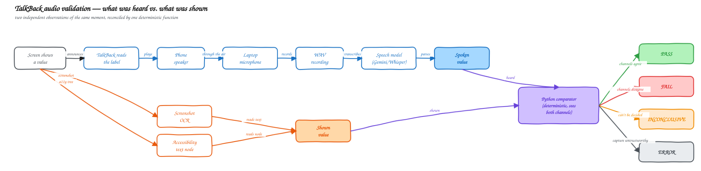
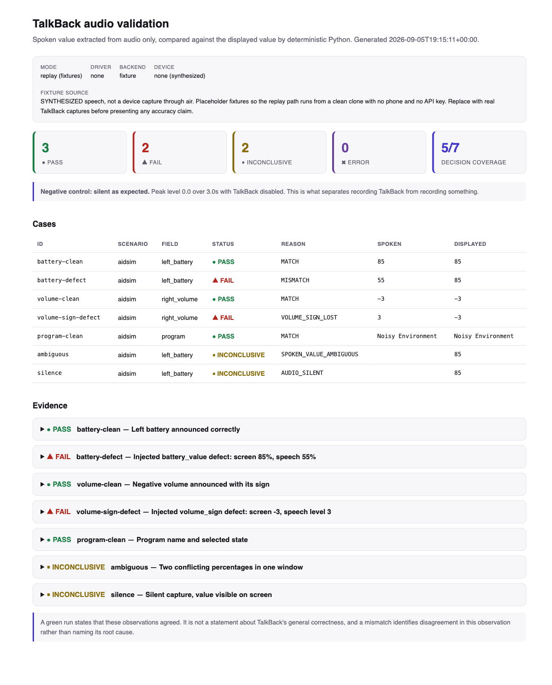
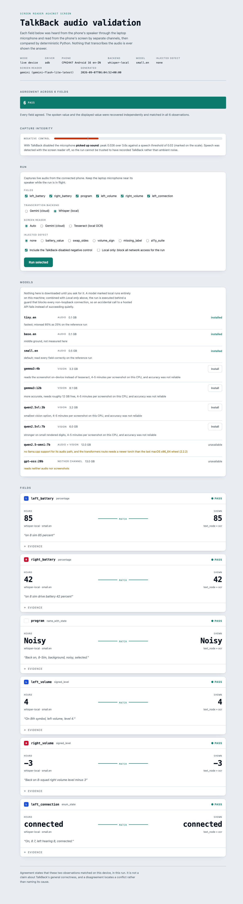
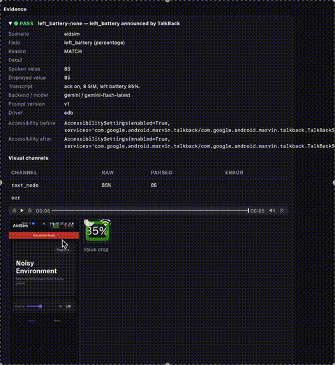

# TalkBack audio validation

Checks that Android's screen reader **actually says out loud what the screen shows**.

A blind user of a hearing-aid app never sees the screen. If the app displays `-3` but
TalkBack announces "level 3", the screen is right, the automated UI test is green, and the
user is told the wrong thing. No test that reads the UI tree can catch that, because the
UI tree is correct. You have to listen.

So this does listen. The phone speaks, a laptop microphone records the air, a speech model
transcribes the recording, and deterministic Python compares that spoken value against the
value read independently from the screen.

```
screen -> TalkBack -> speaker -> air -> microphone -> WAV -> speech model -> spoken value
screen -> screenshot OCR + accessibility text node -------------------------> shown value
                    Python comparator -> PASS / FAIL / INCONCLUSIVE / ERROR
```



Editable source: [`artifacts/diagrams/pipeline-flow.excalidraw`](artifacts/diagrams/pipeline-flow.excalidraw)
(open at [excalidraw.com](https://excalidraw.com) via Open → select the file).

**Evaluating this submission?** Start with [`EVALUATOR_GUIDE.md`](EVALUATOR_GUIDE.md) instead
of this README — it walks through real, already-executed test cases (what TalkBack said, what
the screen showed, why the comparator ruled the way it did) rather than explaining the setup
from scratch.

---

## Demo

Report dashboard after a clean run — the Run panel, installed models, and all six fields
agreeing:



Same dashboard after injecting `volume_sign` — one field disagrees, and the summary reads
`FAIL`, not a silent pass:



Video, with sound — one evidence card expanded, playing the recorded audio for a PASS
verdict against what the screen showed:



Full clip with audio: [`artifacts/demo-video/evidence-pass-demo.mov`](artifacts/demo-video/evidence-pass-demo.mov)
(GitHub's file viewer plays it; the GIF above has no sound).

---

## 1. Run it

```bash
./run-demo.sh --replay     # no phone, no API key, no microphone. Start here.
./run-demo.sh              # full live run against a connected Android phone
```

Both install everything they need, run the test suite, execute the pipeline, and open the
report. `--replay` works from a clean clone and exercises the whole pipeline over committed
fixtures.

The live run installs the shipped `artifacts/aidsim.apk`. It never builds the app: no
Gradle, no Android SDK build tools, no app source needed. Verified by deleting
`talkback-demo-app/` entirely and running it.

---

## 2. How it proves it can catch a real bug

This is the part worth your attention.

Anyone can write a validator that passes. The question is whether it fails when it should.
So the demo app ships with **deliberately broken accessibility labels** you switch on from
the command line:

```bash
uv run talkback-validator run aidsim --defect volume_sign --control
```

The critical detail: a defect corrupts **only the `contentDescription`** — the string
TalkBack reads aloud. **The visible text stays correct.** The screen keeps showing `-3`
while the speech says "level 3". That asymmetry is the whole point: it reproduces the exact
class of bug this tool exists to find, and it is invisible to any test that inspects the UI
tree instead of the audio.

| `--defect` | What breaks | Expected verdict |
|---|---|---|
| `none` | nothing; labels are correct | `PASS` |
| `battery_value` | speech says a different percentage than the screen | `FAIL` |
| `swap_sides` | left announces the right side's value | `FAIL` |
| `volume_sign` | `-3` is announced as "level 3" | `FAIL` |
| `missing_label` | the control has no spoken label at all | `FAIL` |
| `a11y_suite` | five structural label faults for the tree audit | findings |

`volume_sign` is the one to try. A single missing minus sign is something fuzzy string
matching would happily accept and a human listening casually would miss.

**The defect flag is not an answer key.** It sets the phone's state. The comparator never
sees it, never sees the intent extras, and never sees the expected value.

---

## 3. What the report shows

Open the dashboard and each field is a direct confrontation: what was **heard** on the left,
what was **shown** on the right, and the verdict on the line between them.

| Outcome | Meaning |
|---|---|
| `PASS` | the spoken value and the shown value agree |
| `FAIL` | they disagree — a real defect for this observation |
| `INCONCLUSIVE` | the evidence does not support a decision; never counted as a pass |
| `ERROR` | the capture itself failed |

**Negative control.** Every run can include one extra capture with TalkBack switched *off*,
which should record silence. Without it, a silent result is ambiguous: did TalkBack fail to
speak, or was the microphone muted? If the control picks up sound, the run was recording the
room rather than the phone, and the report says the run cannot be trusted.

**Abstention is a first-class result.** Ambiguity produces `INCONCLUSIVE`, never a guess,
and it is never folded into a passing count.

---

## 4. Design decisions

**The speech model only ever receives audio.** Not the screenshot, not the expected value,
not the intent extras. If it saw any of them it could infer the answer instead of reporting
it. Only the comparator sees both channels, and plain Python — not a model — decides whether
two values are equal.

**Two independent visual channels.** Screenshot OCR and the accessibility text node are
peers. When they disagree the result is `INCONCLUSIVE`, not a silent tiebreak.

**Black box by construction.** A test team receives an APK, not source. The validator reads
only `artifacts/aidsim.apk` and `artifacts/INTERFACE.md`; the package and activity come from
`aapt2 dump badging`, never hardcoded; locators are discovered from runtime hierarchy dumps.
`tests/test_black_box_boundary.py` fails the build if any validator source references the app
tree.

**The gotcha that makes this hard.** A `UiAutomation` connection — `uiautomator dump`, an
Appium UiAutomator2 session — suppresses TalkBack. It silences the exact speech being
recorded, and the result looks identical to a TalkBack defect. Hierarchy reads are therefore
sequenced strictly outside every audio window, and accessibility settings are recorded on
both sides of each capture. A silent capture whose settings changed is reported as
`ACCESSIBILITY_SUPPRESSED`, never as `FAIL`.

---

## 5. Tests

```bash
cd talkback-validator && uv sync --quiet --extra bdd && uv run --with pytest pytest -q   # 153 tests
```

Beyond the usual coverage, there are **regression tests written for failures that actually
happened during development**. Each exists because something broke, not because a checklist
asked for it:

| Test | The failure it locks down |
|---|---|
| `test_log_stays_valid_json_while_the_run_writes_to_it` | the live log was joined while a thread appended to it, returning torn strings that broke the browser |
| `test_panel_recovers_the_button_when_the_server_is_gone` | a dead server left the Run button disabled forever with no message |
| `test_removing_a_whisper_model_deletes_its_cache` | `models remove` reported success and left 464 MB on disk |
| `test_a_running_server_counts_even_without_a_local_binary` | a model reported itself unavailable while its calls were succeeding |
| `test_a_blocked_model_never_reports_itself_installed` | a model that cannot run here could be selected and fail mid-capture |
| `test_signed_level_ignores_noise_number_before_level` | background chatter injected a stray number into a real capture |
| `test_the_panel_offers_every_defect_the_app_implements` | the app had six defect modes; the dashboard exposed five |
| `test_public_address_is_refused` | proves offline mode is enforced, not merely claimed |

Tests that depend on host state are pinned, so results do not change based on which models a
developer happens to have downloaded.

### BDD: the comparator's contract, in Gherkin

`compare()` is the one function that sees both channels and decides `PASS` / `FAIL` /
`INCONCLUSIVE` / `ERROR`. That decision is a **contract**, not an implementation detail — it
is the thing a test architect, a PM, or a future contributor needs to read and trust without
opening `comparison.py`. So it is specified in
[Gherkin](https://cucumber.io/docs/gherkin/reference/), the plain Given/When/Then language
Behavior-Driven Development uses to make behavior legible to non-programmers, and executed
for real by [pytest-bdd](https://pytest-bdd.readthedocs.io/) against the actual code:

```gherkin
Scenario: A negative sign is dropped in speech
  Given the screen shows the signed level -3
  And TalkBack announces "Right volume, level 3"
  When the two channels are compared
  Then the verdict is FAIL
  And the reason is VOLUME_SIGN_LOST
```

The pieces:

| File | Role |
|---|---|
| [`features/comparison.feature`](talkback-validator/features/comparison.feature) | The spec. 15 scenarios in Given/When/Then, one per verdict the comparator can reach. This is what an evaluator reads first — it doubles as the acceptance criteria. |
| [`tests/step_defs/test_comparison_steps.py`](talkback-validator/tests/step_defs/test_comparison_steps.py) | The glue. Each `@given`/`@when`/`@then` maps one line of English to a call against the real `parse_*` and `compare()` functions. It builds `VisualResult` / `CaptureValidity` objects and asserts on the returned `CaseResult` — it never re-implements the verdict logic itself, so a scenario only stays green if the actual comparator produces that verdict. |
| `scenarios("../../features/comparison.feature")` | The one line that tells pytest-bdd to compile every scenario above into a real pytest test function, discoverable and runnable exactly like the rest of the suite. |

**Why BDD here and not everywhere.** `compare()` is pure, deterministic, and the whole point
of the project — worth a spec a non-engineer can audit. The capture pipeline around it (ADB,
the microphone, Whisper/Gemini) is infrastructure with side effects; that stays as ordinary
pytest unit and regression tests (the table above), because Gherkin adds no clarity to
mocking a socket.

**Two different things are called "fixtures" in this repo — don't conflate them.** The `given`
steps above use a pytest **fixture** (`context`, dependency-injected per scenario) to carry
state between steps. That is unrelated to [`fixtures/`](talkback-validator/fixtures/) at the
repo root, which holds *data* fixtures — committed WAV recordings and transcripts (§1's
`--replay` mode plays these back with no phone and no microphone). One is a testing
mechanism; the other is recorded evidence. Same word, different job.

Run just the specs:

```bash
uv run --with pytest --with pytest-bdd pytest tests/step_defs -v
```

Add a new one by adding a `Scenario:` to the `.feature` file first — if a `Given`/`When`/`Then`
line has no matching step, pytest-bdd fails with the missing pattern rather than silently
skipping it, so an incomplete spec is never mistaken for a passing one.

---

## 6. Local and offline models

The cloud speech model is the default. It can be replaced entirely:

```bash
uv run talkback-validator models list                    # nothing is installed by default
uv run talkback-validator models install small.en        # local speech
uv run talkback-validator run aidsim --backend whisper --local-only
```

`--local-only` runs the capture behind a guard that blocks every non-loopback connection
**and** every DNS lookup, so an accidental call to a hosted API raises instead of quietly
succeeding. Models are also installable from the dashboard's Models panel.

Measured honestly: local **speech** (Whisper `small.en`) is accurate and fast, about 1.6 s
per clip. Local **vision** models for reading the screen work but were 4–5 minutes per
screenshot on a CPU-only Intel Mac with unreliable accuracy, so the catalogue warns before
you download one. Qwen2.5-Omni is listed but blocked on that platform, with the reason shown.

---

## 7. Removing everything this installs

Model weights are large and live outside the repo. Nothing here is installed until you ask
for it, and all of it is removable.

**Where things live**

| What | Where | Typical size |
|---|---|---|
| Whisper speech models | `~/.cache/huggingface/hub/models--Systran--faster-whisper-*` | 74 MB – 1.4 GB each |
| Vision model weights | `~/.ollama/models` | 3–8 GB each |
| Local model runtime | `talkback-validator/.runtime/` | ~150 MB |
| Python virtualenv | `talkback-validator/.venv/` | ~344 MB |
| Run outputs (WAV, PNG, HTML) | `talkback-validator/runs/` | grows per run |
| Your API key | `talkback-validator/.env` | — |

**Remove models through the tool** (works for both engines, and reports failure rather than
pretending):

```bash
cd talkback-validator
uv run talkback-validator models list                # see what is installed
uv run talkback-validator models remove gemma3:4b
uv run talkback-validator models remove small.en
```

**Remove everything by hand**, if the runtime is already gone:

```bash
rm -rf ~/.ollama                                     # all vision model weights
rm -rf ~/.cache/huggingface/hub/models--Systran--faster-whisper-*   # all speech models
cd talkback-validator
rm -rf .runtime .venv runs .pytest_cache
find . -name __pycache__ -type d -exec rm -rf {} +
rm .env                                              # your API key
```

**Clean the phone too.** The live run installs three packages and changes accessibility
settings:

```bash
adb uninstall com.talkbacklab.aidsim
adb uninstall com.talkbacklab.focushelper
adb uninstall com.talkbacklab.focushelper.test
```

The negative control disables TalkBack during a run and restores it afterwards. If a run is
interrupted mid-control, TalkBack may be left off. Re-enable it in
**Settings → Accessibility → TalkBack**, or:

```bash
adb shell settings put secure enabled_accessibility_services \
  com.google.android.marvin.talkback/com.google.android.marvin.talkback.TalkBackService
adb shell settings put secure accessibility_enabled 1
```
